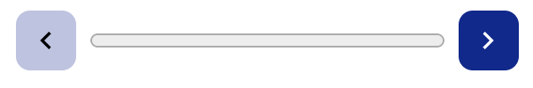

<h2 class="c-project-heading--task"></h2>
--- task ---
Click 
--- /task ---

Look at the output:

<div class="c-project-output">
```
Replacing are with be...
Replacing you with ye...
You be a pirate
```
</div>

Click the arrow for the next challenge.



